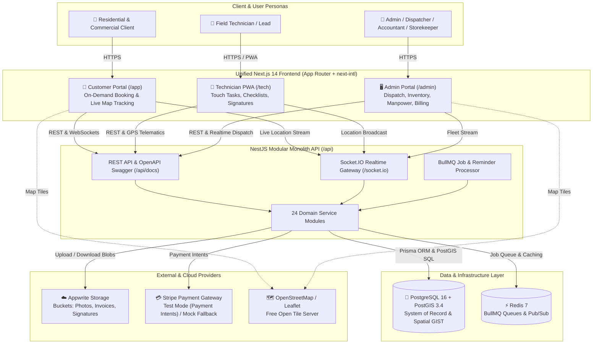
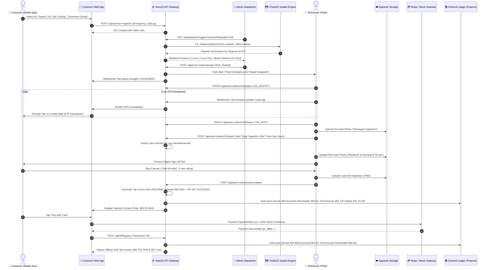
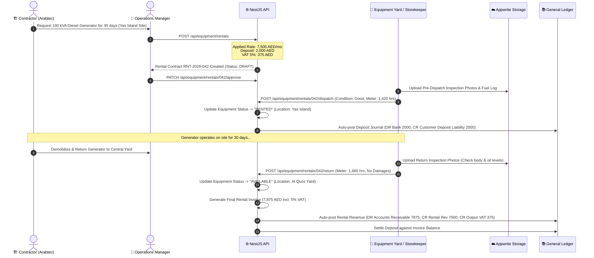
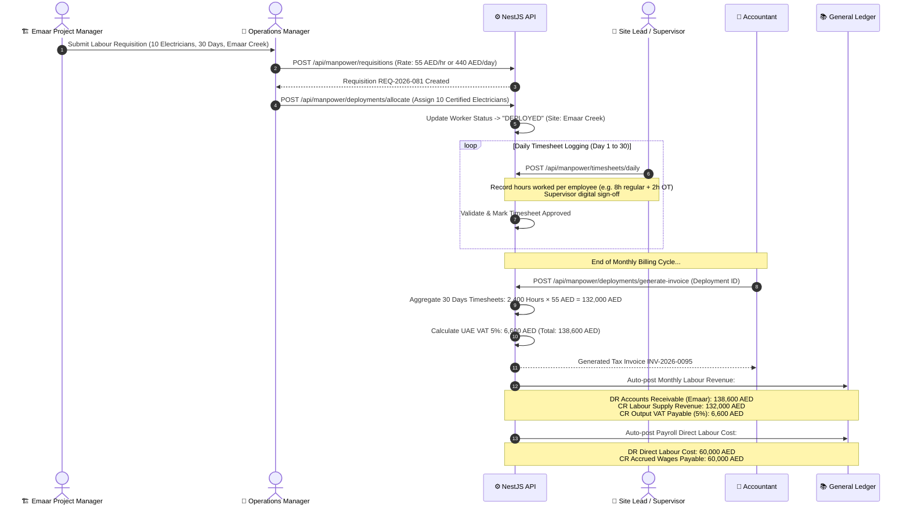

# FieldOps ERP - System Architecture

FieldOps ERP is an enterprise-grade field-service, maintenance, construction site manpower supply, and equipment rental ERP platform tailored for UAE MEP contractors and service companies.

---

## 1. System Context Diagram

The following Mermaid diagram illustrates the system context, actors, client portals, external cloud services, and the core backend modular monolith:

---

## 2. NestJS Module Map (24 Domain Modules)

FieldOps ERP enforces strict modular boundaries within a modular monolith. Each domain module encapsulates its own controllers, services, repositories, and business logic:

| # | NestJS Module | Responsibility | Key Entities & Relations |
|---|---|---|---|
| **1** | `AuthModule` | JWT auth, refresh token rotation, bcrypt password hashing, and RBAC guards. | `User`, `Role`, `Permission`, `RefreshToken` |
| **2** | `UsersModule` | Internal staff user accounts, role assignment, and profile management. | `User`, `UserRole`, `Role` |
| **3** | `CustomersModule` | CRM for residential owners, B2B property managers, and contractor clients (TRN). | `Customer`, `CustomerContact`, `CustomerAsset` |
| **4** | `SitesModule` | Customer site locations, GIS coordinates, Makani numbers, and building details. | `CustomerSite` (PostGIS `geography(Point,4326)`) |
| **5** | `ServiceCatalogModule` | MEP service packages (AC, Plumbing, Electrical), rate types, and price lists. | `ServiceCategory`, `Service`, `PriceList`, `PriceListItem` |
| **6** | `ServiceRequestsModule` | Intake of customer requests (App, WhatsApp, phone) and SLA triage. | `ServiceRequest`, `Complaint` |
| **7** | `WorkOrdersModule` | Core FSM state machine, tasks, removed/fitted parts tracking, and expenses. | `WorkOrder`, `WorkOrderTask`, `WorkOrderPart`, `WorkOrderLabour`, `WorkOrderExpense` |
| **8** | `DispatchModule` | Auto/manual job allocation and PostGIS spatial proximity ranking. | `WorkOrderAssignment`, `TechnicianLocation` |
| **9** | `TrackingModule` | Realtime GPS telematics ingestion, speed, heading, and last-known location views. | `TechnicianLocation` (PostGIS GIST), `v_last_known_technician_locations` |
| **10** | `TechniciansModule` | Field technicians, helpers, supervisors, skills, and vehicle assignments. | `Employee`, `EmployeeSkill`, `Warehouse` (Van) |
| **11** | `AttendanceModule` | Mobile check-in/out with GPS location validation and leave tracking. | `EmployeeAttendance`, `EmployeeLeave` |
| **12** | `InventoryModule` | Stock levels across Central Al Quoz Warehouse, Mobile Vans, and stock movements. | `Item`, `Warehouse`, `StockLevel`, `StockMovement` |
| **13** | `PurchasingModule` | Supplier purchase orders, goods receipt notes (GRN), and supplier bills. | `PurchaseOrder`, `PurchaseOrderLine`, `GoodsReceipt`, `SupplierInvoice` |
| **14** | `SuppliersModule` | MEP vendor directory, TRN validation, payment terms, and vendor performance. | `Supplier`, `SupplierPayment` |
| **15** | `MaterialSalesModule` | Counter and POS direct sales of plumbing, electrical, and HVAC components. | `MaterialSalesOrder`, `MaterialSalesOrderLine` |
| **16** | `EquipmentRentalModule` | Heavy equipment asset register, rental contracts, mobilization, and returns. | `RentalEquipment`, `RentalContract`, `RentalContractLine`, `RentalDispatchReturn` |
| **17** | `QuotationsModule` | Estimation, versioned quotations, discount approval workflows, and terms. | `Quotation`, `QuotationLine` |
| **18** | `InvoicesModule` | UAE FTA-compliant 5% VAT Tax Invoices, credit notes, and balance due tracking. | `Invoice`, `InvoiceLine`, `CreditNote` |
| **19** | `PaymentsModule` | Payment capture (Stripe Test / Mock Card / Cash / Cheque) and multi-invoice allocations. | `Payment`, `PaymentAllocation` |
| **20** | `FinanceModule` | Double-entry general ledger, UAE chart of accounts, and automated journal postings. | `ChartOfAccounts`, `JournalEntry`, `JournalLine`, `BankAccount` |
| **21** | `ReportsModule` | Analytical reporting views (Job profitability, tech performance, aging, P&L). | `v_job_profitability`, `v_monthly_pnl`, `v_receivables_aging` |
| **22** | `NotificationsModule` | Bilingual (EN/AR) in-app alerts, simulated WhatsApp, and email fan-out. | `NotificationTemplate`, `Notification`, `Reminder` |
| **23** | `AutomationModule` | Rule engine: event triggers, threshold conditions, and approval workflows. | `ApprovalRequest`, `AutomationRule` |
| **24** | `AuditModule` | Immutable audit log capturing actor, action, timestamp, and JSON diffs. | `AuditLog` |

---

## 3. End-to-End Sequence Diagrams

### (a) Customer AC Repair On-Demand Flow
*Customer books emergency repair in Downtown Dubai -> Dispatcher assigns closest tech via PostGIS -> Tech travels with live Leaflet map updates -> Tech completes job with before/after photos and parts -> Customer pays 5% VAT invoice via Stripe/Mock.*

---

### (b) Equipment Rental Contract & Mobilization Lifecycle
*Contractor books 100 kVA Diesel Generator -> Contract created with 5% VAT -> Pre-dispatch inspection photos -> Site mobilization -> Equipment return with hours meter check -> Final rental tax invoice.*

---

### (c) Construction Site Labour Supply & Monthly Timesheet Billing
*Contractor requisitions 10 Electricians for 30 days -> Workers deployed to Emaar Creek Harbour -> Daily timesheets logged by site supervisor -> Monthly consolidated tax invoice generated & posted to ledger.*

