# FieldOps ERP - Database Architecture & Schema Specification

FieldOps ERP operates on **PostgreSQL 16 + PostGIS 3.4**. This document details the complete relational schema, Entity-Relationship Diagram (ERD), PostGIS spatial configuration, index definitions, and analytical SQL reporting views.

---

## 1. Architectural Standards & Invariants

1. **Universal Primary Keys**: Every business table uses a UUID `id` primary key (`id uuid PRIMARY KEY DEFAULT gen_random_uuid()`).
2. **Universal Audit Fields**: Every business table includes:
   - `created_at timestamptz NOT NULL DEFAULT now()`
   - `updated_at timestamptz NOT NULL DEFAULT now()`
   - `created_by uuid REFERENCES users(id)`
   - `deleted_at timestamptz NULL` (Soft delete pattern)
3. **Monetary Precision**: All monetary values are strictly `numeric(14, 2)` (never float or double).
4. **Geospatial Precision**: All spatial coordinates are stored in native PostGIS `geography(Point, 4326)` columns with `GIST` indexes.
5. **UAE FTA VAT 5% Compliance**: Line items store `subtotal`, `vat_rate` (0.05), `vat_amount`, and `total_amount` with cent-accurate rounding.

---

## 2. Entity-Relationship Diagram (ERD)

```mermaid
erDiagram
    %% Identity & RBAC
    users ||--o{ user_roles : has
    roles ||--o{ user_roles : assigned
    roles ||--o{ role_permissions : defines
    permissions ||--o{ role_permissions : grants
    users ||--o{ refresh_tokens : owns
    users ||--o| employees : links

    %% CRM & Assets
    customers ||--o{ customer_contacts : has
    customers ||--o{ customer_sites : operates
    customer_sites ||--o{ customer_assets : houses
    customers ||--o{ maintenance_contracts : signs
    maintenance_contracts ||--o{ contract_visit_schedules : schedules

    %% Services & Requests
    service_categories ||--o{ services : contains
    price_lists ||--o{ price_list_items : defines
    services ||--o{ price_list_items : priced_in
    customers ||--o{ service_requests : submits
    service_requests ||--o{ work_orders : initiates
    customers ||--o{ complaints : lodges

    %% Work Orders Core
    work_orders ||--o{ work_order_assignments : allocates
    work_orders ||--o{ work_order_tasks : contains
    work_orders ||--o{ work_order_parts : consumes
    work_orders ||--o{ work_order_labour : records
    work_orders ||--o{ work_order_expenses : incurs
    work_orders ||--o{ work_order_attachments : attaches
    work_orders ||--o| customer_signoffs : receives
    work_orders ||--o{ work_order_status_history : tracks

    %% Workforce & Telematics
    employees ||--o{ work_order_assignments : deployed_to
    employees ||--o{ employee_skills : possesses
    employees ||--o{ employee_attendance : logs
    employees ||--o{ employee_leaves : requests
    employees ||--o{ technician_locations : broadcasts
    employees ||--o{ labour_daily_timesheets : logs_hours
    labour_supply_deployments ||--o{ labour_daily_timesheets : tracks

    %% Inventory & Purchasing
    items ||--o{ stock_levels : stocked_at
    warehouses ||--o{ stock_levels : stores
    items ||--o{ stock_movements : records
    warehouses ||--o{ stock_movements : moves_between
    suppliers ||--o{ purchase_orders : receives
    purchase_orders ||--o{ purchase_order_lines : contains
    purchase_orders ||--o{ goods_receipts : delivers
    goods_receipts ||--o{ goods_receipt_lines : includes
    suppliers ||--o{ supplier_invoices : bills
    supplier_invoices ||--o{ supplier_payments : paid_by

    %% Material Sales
    customers ||--o{ material_sales_orders : places
    material_sales_orders ||--o{ material_sales_order_lines : contains

    %% Equipment Rental
    rental_equipment ||--o{ rental_contract_lines : rented_in
    rental_contracts ||--o{ rental_contract_lines : contains
    rental_contracts ||--o{ rental_dispatches_returns : inspects

    %% Billing & Invoices
    customers ||--o{ quotations : requests
    quotations ||--o{ quotation_lines : contains
    customers ||--o{ invoices : billed_to
    invoices ||--o{ invoice_lines : contains
    invoices ||--o{ credit_notes : adjusted_by
    invoices ||--o{ payments : settled_by
    payments ||--o{ payment_allocations : allocated_to

    %% General Ledger (Double-Entry)
    chart_of_accounts ||--o{ journal_lines : booked_to
    journal_entries ||--o{ journal_lines : balances
    bank_accounts ||--o{ cash_bank_transactions : logs
    employees ||--o{ expense_claims : files
    expense_claims ||--o{ expense_claim_lines : details

    %% Automation & Audit
    users ||--o{ notifications : receives
    users ||--o{ approval_requests : approves
    users ||--o{ audit_logs : triggers
```



---

## 3. Data Dictionary by Business Domain

### 3.1 Identity & Access Control (RBAC)
- **`users`**: System login accounts (email, password hash, status, timestamps).
- **`roles`**: Authorization roles (`SUPER_ADMIN`, `OPERATIONS_MANAGER`, `ACCOUNTANT`, `STOREKEEPER`, `DISPATCHER`, `TECHNICIAN`, `CUSTOMER`).
- **`permissions`**: Granular capability keys (`work_orders:create`, `invoices:approve`, `inventory:transfer`).
- **`role_permissions`**: Many-to-many junction between roles and permissions.
- **`user_roles`**: Many-to-many junction assigning roles to users.
- **`refresh_tokens`**: Hashed cryptographically random JWT refresh tokens with expiry tracking.

### 3.2 CRM & Client Assets
- **`customers`**: Individual residents or commercial property management entities, including UAE Tax Registration Number (`TRN`), credit limits, and payment terms.
- **`customer_contacts`**: Key stakeholder contacts (Property Manager, FM Engineer, Accounts Payable).
- **`customer_sites`**: Geographical service delivery addresses featuring PostGIS `geography(Point,4326)` coordinates, Makani numbers, and building/villa details.
- **`customer_assets`**: Equipment installed at customer sites (Chillers, DB panels, Water Heaters, Boosters) with brand, serial number, and full historical work order logs.
- **`maintenance_contracts` (AMC)**: Annual Maintenance Contracts with contracted visit quotas.
- **`contract_visit_schedules`**: Scheduled periodic preventive maintenance visits linked to work orders.

### 3.3 Services, Price Lists & Requests
- **`service_categories`**: Core trades: Electrical, Plumbing, HVAC, Manpower Supply, Equipment Rental, Material Sales.
- **`services`**: Specific packages (e.g. AC Diagnosis & Gas Top-up, DB Board Upgrade) with rate type (`FIXED`, `HOURLY`, `PER_VISIT`).
- **`price_lists`** & **`price_list_items`**: Tiered price catalogs for standard retail vs B2B commercial accounts.
- **`service_requests`**: Inbound callout requests with source tracking (`APP`, `PHONE`, `WHATSAPP`, `EMAIL`), SLA due deadlines, and priority.
- **`complaints`**: Customer dispute and issue tracking linked to work orders with resolution SLAs.

### 3.4 Work Orders & Execution Engine
- **`work_orders`**: Primary FSM entity tracking lifecycle:
  `NEW` → `QUOTED` → `APPROVED` → `ASSIGNED` → `EN_ROUTE` → `ON_SITE` → `IN_PROGRESS` → `ON_HOLD` → `COMPLETED` → `INVOICED` → `CLOSED` / `CANCELLED`.
- **`work_order_assignments`**: Multi-technician dispatch (Lead Tech + Helpers/Assistants).
- **`work_order_tasks`**: Step-by-step technical and safety checklists.
- **`work_order_status_history`**: Audit trail of every status transition with GPS coordinates and actor.
- **`work_order_parts`**: Exact parts tracking: distinguishing **FITTED_NEW** parts from **REMOVED_DEFECTIVE** components (with serial numbers for warranty validation).
- **`work_order_labour`**: Real hours logged per employee with cost rate vs billing rate.
- **`work_order_expenses`**: Transport, municipal road permits, parking fees.
- **`work_order_attachments`**: Pre-work, post-work, and site diagram images stored in Appwrite Storage.
- **`customer_signoffs`**: Digital signature canvas capture, rating (1-5 stars), and customer feedback.

### 3.5 Workforce, Attendance & Labour Supply
- **`employees`**: Field technicians, helpers, and office staff with trade, Emirates ID, visa expiry, hourly cost, and billing rates.
- **`employee_skills`**: Trade certifications and skill ratings.
- **`employee_attendance`**: Clock-in and clock-out timestamps with PostGIS coordinates and location validation.
- **`employee_leaves`**: Annual, sick, and emergency leave requests with manager approval.
- **`labour_supply_deployments`**: Long-term contractor site allocations (e.g. 10 Electricians at Crescent Bay Commercial Complex).
- **`labour_daily_timesheets`**: Daily supervisor sign-off on hours worked per worker for monthly consolidated invoicing.

### 3.6 Tracking & Spatial Telematics
- **`technician_locations`**: High-frequency telematics table storing timestamped `geography(Point,4326)` points, speed (km/h), heading, and accuracy.

### 3.7 Inventory, Warehouses & Purchasing
- **`items`**: Catalog of materials, spare parts, and consumables with barcode and reorder levels.
- **`warehouses`**: Storage locations, including Central Al Quoz Warehouse and **Mobile Technician Vans**.
- **`stock_levels`**: Quantity on hand, reserved, and available per warehouse/van.
- **`stock_movements`**: Audited movements (`PURCHASE_RECEIPT`, `VAN_TRANSFER`, `JOB_CONSUMPTION`, `JOB_RETURN`, `ADJUSTMENT`, `DIRECT_SALE`).
- **`suppliers`**, **`purchase_orders`**, **`goods_receipts`**, **`supplier_invoices`**, **`supplier_payments`**: Full procurement cycle.

### 3.8 Equipment Rental Fleet
- **`rental_equipment`**: Asset register (Generators, Scaffolding, Scissor Lifts, Breakers) with status and daily/weekly/monthly rates.
- **`rental_contracts`** & **`rental_contract_lines`**: Mobilization agreements with deposit tracking.
- **`rental_dispatches_returns`**: Pre-dispatch and return inspection logs with meter readings and condition photos.

### 3.9 Invoicing, Payments & General Ledger
- **`quotations`** & **`quotation_lines`**: Versioned estimates with discount approval triggers.
- **`invoices`** & **`invoice_lines`**: UAE FTA Tax Invoices with TRN `100000000000003 (demo)`, 5% VAT calculations, and QR code data.
- **`credit_notes`**: Formal VAT-compliant returns and adjustments.
- **`payments`** & **`payment_allocations`**: Dual-mode payment processing (Stripe Test / Mock Card / Cash / Cheque).
- **`chart_of_accounts`**: UAE double-entry chart of accounts (Assets, Liabilities, Equity, Revenue, Cost of Sales, Opex).
- **`journal_entries`** & **`journal_lines`**: Balanced double-entry transactions auto-posted from billing, inventory, and payroll.
- **`bank_accounts`** & **`cash_bank_transactions`**: Bank reconciliation ledger.

---

## 4. PostGIS Spatial Indexing & Telematics Strategy

```sql
-- PostGIS Extension Setup
CREATE EXTENSION IF NOT EXISTS postgis;

-- Spatial GIST Indexes
CREATE INDEX IF NOT EXISTS idx_customer_sites_location ON customer_sites USING GIST (location);
CREATE INDEX IF NOT EXISTS idx_technician_locations_location ON technician_locations USING GIST (location);

-- Composite Time and Status Indexes
CREATE INDEX IF NOT EXISTS idx_technician_locations_emp_time ON technician_locations (employee_id, recorded_at DESC);
CREATE INDEX IF NOT EXISTS idx_work_orders_status_date ON work_orders (status, scheduled_start);
CREATE INDEX IF NOT EXISTS idx_work_orders_customer ON work_orders (customer_id);
```

---

## 5. SQL Reporting Views Specification

### View 1: `v_job_profitability`
Calculates true gross profit per work order:
$$\text{Gross Profit} = \text{Billed Revenue} - (\text{Parts Cost} + \text{Labour Cost} + \text{Expenses})$$
```sql
CREATE OR REPLACE VIEW v_job_profitability AS
SELECT 
    wo.id AS work_order_id,
    wo.order_number,
    wo.title,
    wo.status,
    wo.service_type,
    c.name AS customer_name,
    COALESCE(wo.subtotal, 0.00) AS billed_revenue,
    COALESCE(parts.total_parts_cost, 0.00) AS parts_cost,
    COALESCE(labour.total_labour_cost, 0.00) AS labour_cost,
    COALESCE(expenses.total_expenses, 0.00) AS other_expenses,
    (
        COALESCE(wo.subtotal, 0.00) - 
        (COALESCE(parts.total_parts_cost, 0.00) + COALESCE(labour.total_labour_cost, 0.00) + COALESCE(expenses.total_expenses, 0.00))
    ) AS gross_profit,
    CASE 
        WHEN COALESCE(wo.subtotal, 0.00) > 0 THEN 
            ROUND(
                ((COALESCE(wo.subtotal, 0.00) - (COALESCE(parts.total_parts_cost, 0.00) + COALESCE(labour.total_labour_cost, 0.00) + COALESCE(expenses.total_expenses, 0.00))) / wo.subtotal) * 100, 
                2
            )
        ELSE 0.00 
    END AS gross_margin_percentage
FROM work_orders wo
JOIN customers c ON c.id = wo.customer_id
LEFT JOIN (
    SELECT work_order_id, SUM(quantity * unit_cost) AS total_parts_cost
    FROM work_order_parts
    WHERE deleted_at IS NULL AND part_action IN ('FITTED_NEW', 'CONSUMED')
    GROUP BY work_order_id
) parts ON parts.work_order_id = wo.id
LEFT JOIN (
    SELECT work_order_id, SUM(total_cost) AS total_labour_cost
    FROM work_order_labour
    WHERE deleted_at IS NULL
    GROUP BY work_order_id
) labour ON labour.work_order_id = wo.id
LEFT JOIN (
    SELECT work_order_id, SUM(amount) AS total_expenses
    FROM work_order_expenses
    WHERE deleted_at IS NULL
    GROUP BY work_order_id
) expenses ON expenses.work_order_id = wo.id
WHERE wo.deleted_at IS NULL;
```

### View 2: `v_technician_performance`
Tracks completed jobs count, total hours logged, billed revenue generated, and average customer satisfaction rating:
```sql
CREATE OR REPLACE VIEW v_technician_performance AS
SELECT 
    e.id AS employee_id,
    e.employee_code,
    e.first_name || ' ' || e.last_name AS technician_name,
    e.trade,
    COUNT(DISTINCT woa.work_order_id) FILTER (WHERE wo.status = 'COMPLETED') AS completed_jobs_count,
    COALESCE(SUM(wol.hours), 0.00) AS total_hours_worked,
    COALESCE(SUM(wol.total_billed), 0.00) AS total_labour_revenue_billed,
    COALESCE(ROUND(AVG(cs.rating), 2), 5.00) AS average_customer_rating
FROM employees e
LEFT JOIN work_order_assignments woa ON woa.employee_id = e.id AND woa.deleted_at IS NULL
LEFT JOIN work_orders wo ON wo.id = woa.work_order_id AND wo.deleted_at IS NULL
LEFT JOIN work_order_labour wol ON wol.work_order_id = wo.id AND wol.employee_id = e.id AND wol.deleted_at IS NULL
LEFT JOIN customer_signoffs cs ON cs.work_order_id = wo.id AND cs.deleted_at IS NULL
WHERE e.deleted_at IS NULL
GROUP BY e.id, e.employee_code, e.first_name, e.last_name, e.trade;
```

### View 3: `v_equipment_utilization`
Calculates total rental days active vs idle across the fleet:
```sql
CREATE OR REPLACE VIEW v_equipment_utilization AS
SELECT 
    eq.id AS equipment_id,
    eq.asset_code,
    eq.name,
    eq.category,
    eq.status,
    eq.daily_rate,
    COALESCE(SUM(EXTRACT(DAY FROM (COALESCE(rcl.actual_end_date, CURRENT_DATE) - rcl.start_date))), 0) AS total_rented_days,
    COALESCE(SUM(rcl.total_amount), 0.00) AS total_rental_revenue
FROM rental_equipment eq
LEFT JOIN (
    SELECT rcl.equipment_id, rc.start_date, rc.actual_end_date, rcl.total_amount
    FROM rental_contract_lines rcl
    JOIN rental_contracts rc ON rc.id = rcl.rental_contract_id
    WHERE rc.deleted_at IS NULL AND rcl.deleted_at IS NULL
) rcl ON rcl.equipment_id = eq.id
WHERE eq.deleted_at IS NULL
GROUP BY eq.id, eq.asset_code, eq.name, eq.category, eq.status, eq.daily_rate;
```

### View 4: `v_inventory_status`
Aggregates total stock value and flags items below safety reorder threshold:
```sql
CREATE OR REPLACE VIEW v_inventory_status AS
SELECT 
    i.id AS item_id,
    i.item_code,
    i.name,
    i.type,
    i.cost_price,
    i.selling_price,
    COALESCE(SUM(sl.quantity_on_hand), 0) AS total_quantity_on_hand,
    COALESCE(SUM(sl.quantity_reserved), 0) AS total_quantity_reserved,
    COALESCE(SUM(sl.quantity_available), 0) AS total_quantity_available,
    (COALESCE(SUM(sl.quantity_on_hand), 0) * i.cost_price) AS total_inventory_valuation,
    CASE 
        WHEN COALESCE(SUM(sl.quantity_available), 0) <= MIN(sl.reorder_level) THEN TRUE 
        ELSE FALSE 
    END AS is_reorder_required
FROM items i
LEFT JOIN stock_levels sl ON sl.item_id = i.id AND sl.deleted_at IS NULL
WHERE i.deleted_at IS NULL
GROUP BY i.id, i.item_code, i.name, i.type, i.cost_price, i.selling_price;
```

### View 5: `v_receivables_aging`
Ages outstanding customer invoices into Current, 1-30, 31-60, 61-90, and 90+ days brackets:
```sql
CREATE OR REPLACE VIEW v_receivables_aging AS
SELECT 
    c.id AS customer_id,
    c.name AS customer_name,
    c.trn AS customer_trn,
    COALESCE(SUM(CASE WHEN (CURRENT_DATE - inv.due_date) <= 0 THEN inv.balance_due ELSE 0.00 END), 0.00) AS current_unbilled,
    COALESCE(SUM(CASE WHEN (CURRENT_DATE - inv.due_date) BETWEEN 1 AND 30 THEN inv.balance_due ELSE 0.00 END), 0.00) AS days_1_30,
    COALESCE(SUM(CASE WHEN (CURRENT_DATE - inv.due_date) BETWEEN 31 AND 60 THEN inv.balance_due ELSE 0.00 END), 0.00) AS days_31_60,
    COALESCE(SUM(CASE WHEN (CURRENT_DATE - inv.due_date) BETWEEN 61 AND 90 THEN inv.balance_due ELSE 0.00 END), 0.00) AS days_61_90,
    COALESCE(SUM(CASE WHEN (CURRENT_DATE - inv.due_date) > 90 THEN inv.balance_due ELSE 0.00 END), 0.00) AS days_over_90,
    COALESCE(SUM(inv.balance_due), 0.00) AS total_outstanding_balance
FROM customers c
LEFT JOIN invoices inv ON inv.customer_id = c.id AND inv.payment_status != 'PAID' AND inv.deleted_at IS NULL
WHERE c.deleted_at IS NULL
GROUP BY c.id, c.name, c.trn;
```

### View 6: `v_payables_aging`
Ages outstanding supplier purchase bills:
```sql
CREATE OR REPLACE VIEW v_payables_aging AS
SELECT 
    s.id AS supplier_id,
    s.name AS supplier_name,
    s.trn AS supplier_trn,
    COALESCE(SUM(CASE WHEN (CURRENT_DATE - si.due_date) <= 0 THEN (si.total_amount) ELSE 0.00 END), 0.00) AS current_payable,
    COALESCE(SUM(CASE WHEN (CURRENT_DATE - si.due_date) BETWEEN 1 AND 30 THEN (si.total_amount) ELSE 0.00 END), 0.00) AS days_1_30,
    COALESCE(SUM(CASE WHEN (CURRENT_DATE - si.due_date) BETWEEN 31 AND 60 THEN (si.total_amount) ELSE 0.00 END), 0.00) AS days_31_60,
    COALESCE(SUM(CASE WHEN (CURRENT_DATE - si.due_date) > 60 THEN (si.total_amount) ELSE 0.00 END), 0.00) AS days_over_60,
    COALESCE(SUM(si.total_amount), 0.00) AS total_outstanding_payable
FROM suppliers s
LEFT JOIN supplier_invoices si ON si.supplier_id = s.id AND si.status != 'PAID' AND si.deleted_at IS NULL
WHERE s.deleted_at IS NULL
GROUP BY s.id, s.name, s.trn;
```

### View 7: `v_monthly_pnl`
Monthly Profit and Loss derived directly from the balanced double-entry general ledger:
```sql
CREATE OR REPLACE VIEW v_monthly_pnl AS
SELECT 
    TO_CHAR(je.entry_date, 'YYYY-MM') AS fiscal_month,
    COALESCE(SUM(jl.credit_amount - jl.debit_amount) FILTER (WHERE coa.type = 'REVENUE'), 0.00) AS total_revenue,
    COALESCE(SUM(jl.debit_amount - jl.credit_amount) FILTER (WHERE coa.type = 'DIRECT_COST'), 0.00) AS cost_of_goods_and_services,
    (
        COALESCE(SUM(jl.credit_amount - jl.debit_amount) FILTER (WHERE coa.type = 'REVENUE'), 0.00) -
        COALESCE(SUM(jl.debit_amount - jl.credit_amount) FILTER (WHERE coa.type = 'DIRECT_COST'), 0.00)
    ) AS gross_profit,
    COALESCE(SUM(jl.debit_amount - jl.credit_amount) FILTER (WHERE coa.type = 'EXPENSE'), 0.00) AS operating_expenses,
    (
        COALESCE(SUM(jl.credit_amount - jl.debit_amount) FILTER (WHERE coa.type = 'REVENUE'), 0.00) -
        COALESCE(SUM(jl.debit_amount - jl.credit_amount) FILTER (WHERE coa.type = 'DIRECT_COST'), 0.00) -
        COALESCE(SUM(jl.debit_amount - jl.credit_amount) FILTER (WHERE coa.type = 'EXPENSE'), 0.00)
    ) AS net_profit
FROM journal_lines jl
JOIN journal_entries je ON je.id = jl.journal_entry_id AND je.status = 'POSTED' AND je.deleted_at IS NULL
JOIN chart_of_accounts coa ON coa.id = jl.account_id AND coa.deleted_at IS NULL
GROUP BY TO_CHAR(je.entry_date, 'YYYY-MM')
ORDER BY fiscal_month DESC;
```
